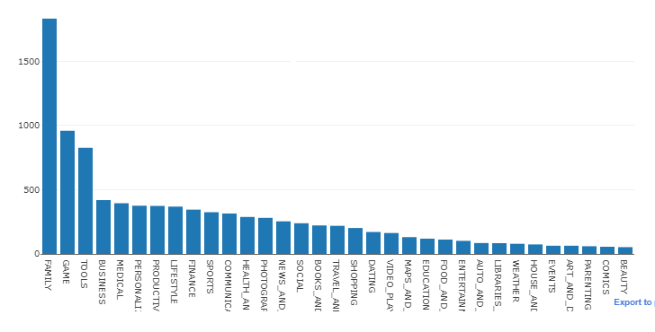
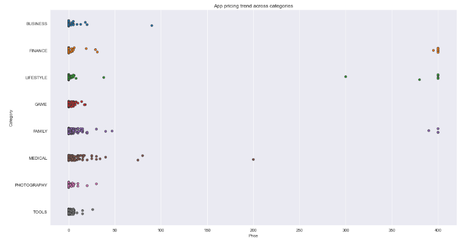
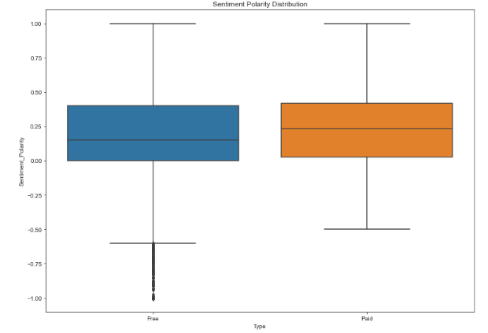

# Google Play App Market
This is analysis of android app market on Google Play

## What is Google Play Store? 
Google Play Store is an online marketplace created by Google specifically for Android devices. It functions as the main hub for downloading and installing a diverse collection of software applications (apps), games, films, music, and additional digital media onto Android smartphones and tablets.

# This Project
I used datasets from DataCamp to address the following inquiries:

1. Determining the most frequently utilized apps in the Google Play Store by categories
2. Uncovering the relationship between app category and pricing
3. Gaining insights into user sentiments and perceptions towards various apps

# My discoveries revealed that...
 

## Most frequently utilized apps in the Google Play Store by categories

Based on my exploration of app categories, I discovered that the Family category contains the most frequently utilized apps in the Google Play Store.
 

## Relationship between app category and pricing

The relationship between app category and pricing is evident from the datasets, where a substantial number of apps fall under the family, category, and lifestyle genres. This trend raises intriguing questions about the underlying factors driving this phenomenon. Delving into the reasons behind the prevalence of these categories in the app market could shed light on the dynamics between user preferences, market demands, and pricing strategies.
 

## Insights into user sentiments

Exploring user sentiments provides valuable insights into the dynamics of app reviews, particularly the intriguing trend where free apps tend to attract more negative sentiments such as hate comments and low ratings compared to their paid counterparts. Unraveling the factors behind this phenomenon offers a deeper understanding of user behavior and sheds light on the intricate interplay of pricing, expectations, and app quality, ultimately contributing to a comprehensive picture of user preferences and motivations.
 

